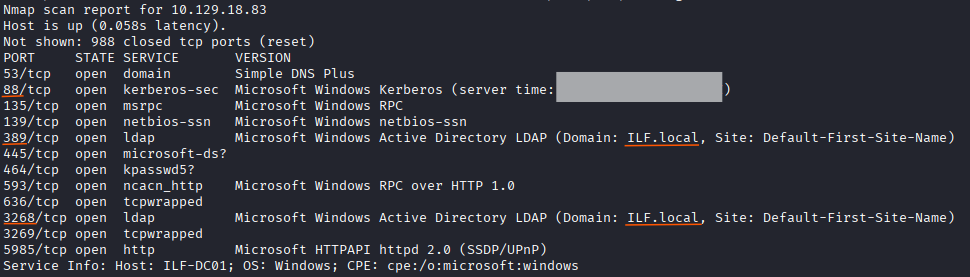
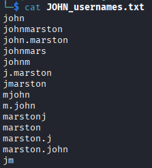
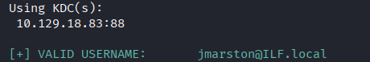
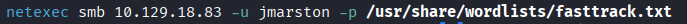
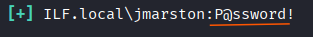
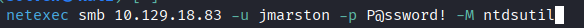
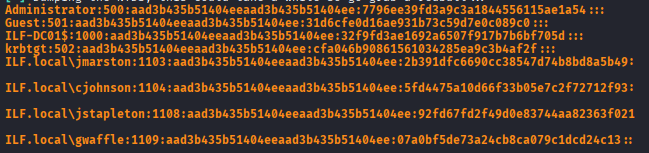
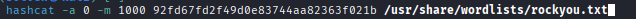
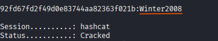

# Attacking Active Directory and NTDS.dit (HackTheBox)

## Short description: 

The aim is to get into the Active Directory environment to get the NTDS.dit file. After obtaining NTDS.dit file extract password from the hash for a user.

## Prerequisites:
User to gain a foothold John Marston

## Goal:
* Submit John Marston's credentials as the answer.
* Crack Jennifer Stapleton's password. Submit her clear-text password as the answer.

---

## Enumeration

Initial port scanning and service enumeration on the target Domain Controller to confirm its identity and open services

```
nmap 10.129.202.85 -sV -oN initial-enum
```


I can assume that it’s a Domain Controller with domain name ILF.local because the nmap scan shows the necessary Active Directory services running, including ```Kerberos (88/tcp)```, ```LDAP (389/tcp)```, and the ```Global Catalog (3268/tcp)```.

The file stored on a domain controller that contains the password hashes of all domain accounts is NTDS.dit

## Getting John Marston credentials

As the question is specifically asking for John Marston's credentials, I have created .txt file his with name and surname and used a tool username-anarchy to generate a large list of potential usernames with his name:




I used kerbrute to perform an Active Directory user enumeration attack against the domain over the Kerberos protocol. This tool validates actual users in AD.




I have valid username so I can try brute-force it with NetExec through SMB protocol using fasttrack.txt wordlist





## Getting NTDS.dit

Using NetExec I can capture NTDS.dit



I got the NTLM hashes of users 



## Cracking Jennifer Stapleton's hash
I need to get the password for the user Jennifer Stapleton.

Hash-Mode for NTLM hashes in hashcat is ```1000```



Finally I have got the clear-text password for the Jennifer Stapleton

