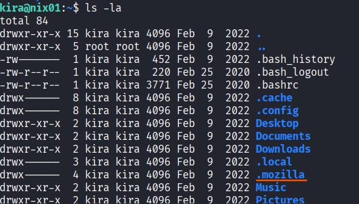
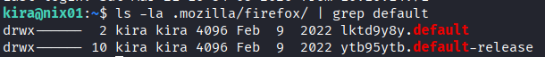
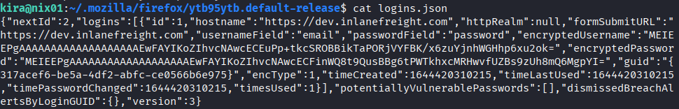
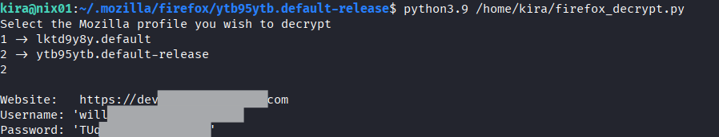

# Credential Hunting (HackTheBox)

## Goal
Inspect the target and extract the user Will’s password from browser-stored credentials.


## Tools
- ssh
- python ftp server
- firefox_decrypt


### Process
Connecting to the target using ```ssh```. 


While inspecting the current working directoty I noticed that there is a hidden file ```.mozilla```.



I know that credentials for a web page in the Firefox browser are encrypted and stored in ```logins.json``` on the system.



Next, I examined the contents of the ```logins.json``` file within that profile. This file contained the stored usernames and passwords for websites, but as shown in the output, the credentials are encrypted using Firefox's built-in mechanism.




```firefox_decrypt``` tool is a Python utility designed to recover passwords from Firefox's profile files by using the database and keys found in the profile directory.

I found this tool on my ```attack host``` and prepared ```ftp server``` to transfer the ```firefox_decrypt``` to my ```target machine```.


Finally I executed the decryption tool on the ```target machine``` and got a user's password.

