# Cap 

#### Prepared by: s0lven
#### Machine Author(s): infosecjak
#### Difficulty: Easy
#### Classification: Official 


---
# Synopsis
Cap is an easy difficulty Linux machine running an HTTP server that performs administrative
functions including performing network captures. Improper controls result in Insecure Direct
Object Reference (IDOR) giving access to another user's capture. The capture contains plaintext
credentials and can be used to gain foothold. A Linux capability is then leveraged to escalate to
root.

# Enumeration

## Nmap


Nmap discovered three running ports: SSH(22), FTP(21), and an HTTP server on port 80.

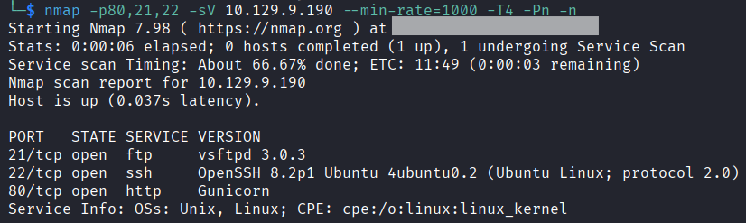

---

## FTP 

Checking wheather FTP has anonymous access enabled.

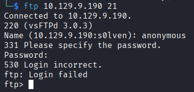

The login fails, which means that the anonymous access is disabled. 

## HTTP

According to nmap, port 80 is running Gunicorn, which is a python based HTTP server. Entering the URL of the website I see the page that reveals a dashboard.

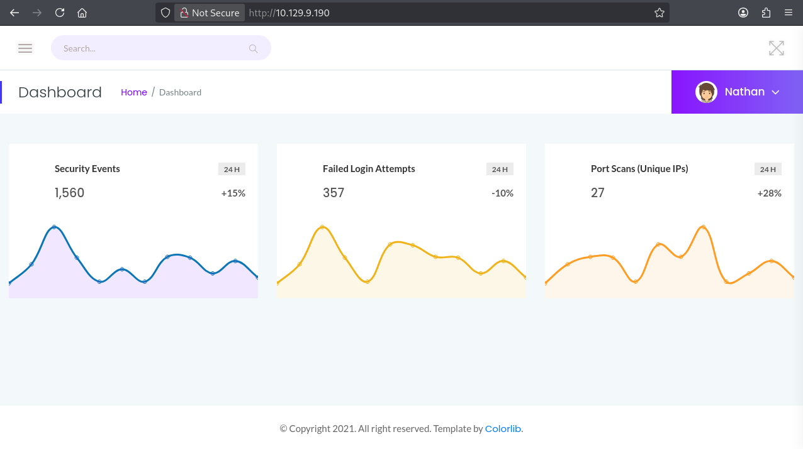

Opening the ```IP Config``` page reveals the output of ```ifconfig``` command.

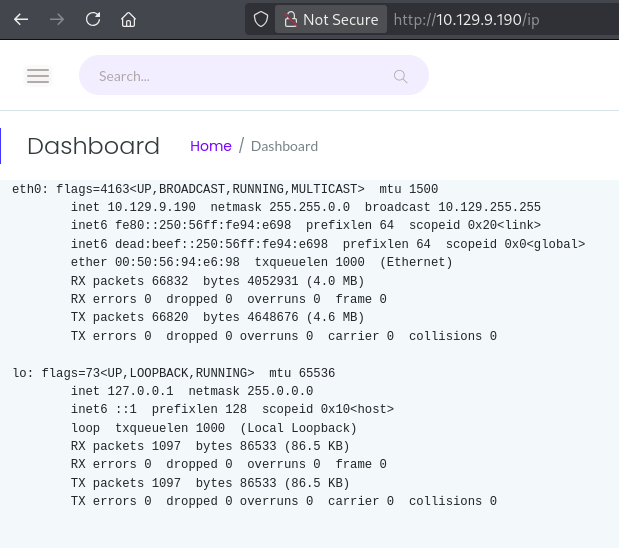

The ```Network Status``` page reveals the output for ```netstat``` . This allows to assume that the application is executing system commands. Clicking on the ```Security Snapshot (5 Second PCAP + Analysis)``` menu item loads the page for a few seconds and returns a page represented below:

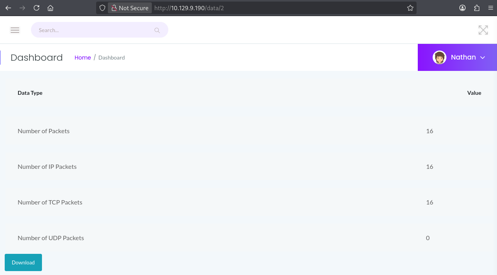

While clicking on ```Download``` button loads a packet capture file, which I can examine using WireShark.

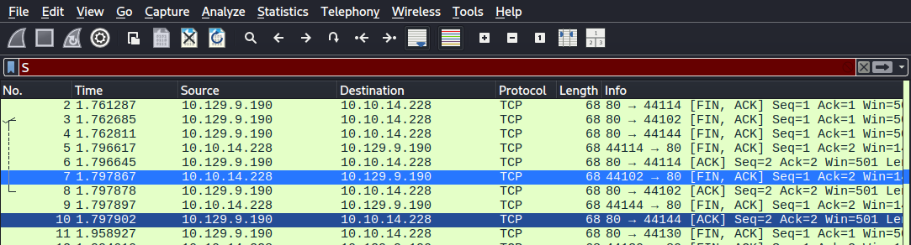

After taking a look at the capture, I see that it just contains HTTP traffic from me.

## IDOR

Searching throught the website I found that the interesting thing to notice is the URL scheme when creating a new capture, that is of the form ```/data/id```. The ```id``` is incremented for every capture. It can be possible that there were packet captures from other users before.

After changing some values I figured out that ```/data/0``` does indeed reveal a packet capture with multiple packets.


Having vulnerability when a user can directly access data owned by another user is known as Insecure Direct Object Reference (IDOR).
It is high time to analyse the downloaded ```.pcap``` file for potential sensitive data captures.

# Getting Foothold

Going through the previously downloaded capture file in Wireshark I see the FTP traffic, including the user authentication.

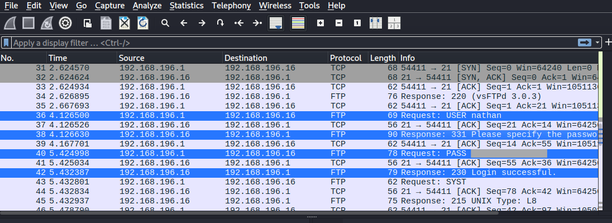

As the traffic is not encrypted, this allows me to retrieve the user credentials ```USER``` and ```PASS```.


### FTP connection

I tried to connect to FTP service once again using obtained credentials and succeeded. After listing current working directory I found a ```user.txt``` file containing ```user``` flag.

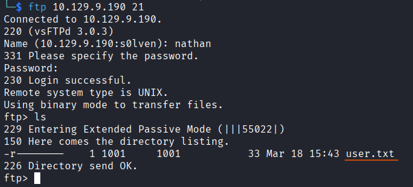

Using a technique called password spraying revealed that the found credentials are valid not only for FTP but can be used to login via SSH.

### SSH connection 

When connecting to the SSH service, I found the same ```user.txt``` file as it was in case of FTP.


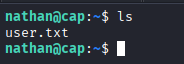

# Privilege Escalation

I tried to check my user's privileges using ```sudo -l``` command but that was unsuccessful. So I decided to use the ```linPEAS``` script to check for privilege escalation vectors.

As the script is on my attack host I have to move it to the target machine. I created a Python webserver serving a directory on my attack host containing ```linpeas.sh``` by running ```sudo python3 -m http.server 80```.

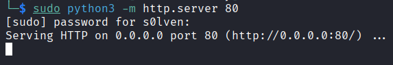

Now, from the shell on Cap vulnerable machine, I can fetch ```linpeas.sh``` with ```curl``` and pipe the output directly into ```bash``` to execute it:


The report of the ```linpeas.sh``` script contains an interesting entry for files with capabilities. The ```/usr/bin/python3.8``` is found to have ```cap_setuid``` and ```cap_net_bind_service```, which isn't the setting by default.

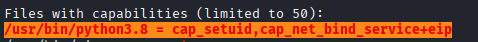

So, conducting some research, I have figured out that ```cap_setuid``` allows the process to gain ```setuid``` privileges without the ``SUID`` bit set. This gives me an opportunity to switch the ``UID`` value to ``0`` which means ```root```. I guess, as simple user cannot capture the traffic, so such capability was given to Python enabling the site to do that.

To get a root shell I need to execute the following commands:

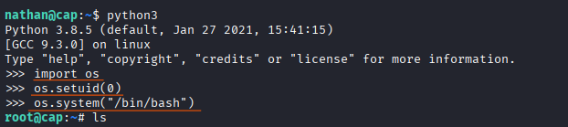

Got the ```root``` flag inside of the ```root.txt```.